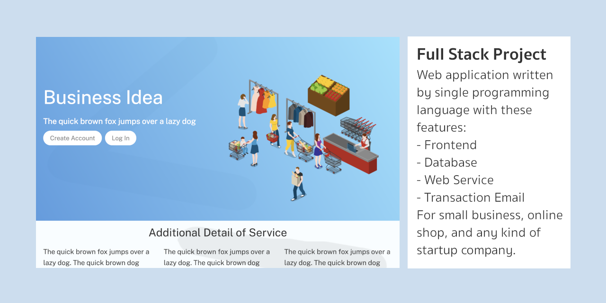

## The Basic Project

Project นี้เป็น Web Application
แบบ Full Stack มีครบทุกส่วน
ตั้งแต่ Frontend, Datatabase, Web Service, รวมถึงระบบ Transaction Email




## Branches
Project นี้จะมี 3 Branches คือ basic, database, และ full

```
basic    ---> for common web site
database ---> for common web site with contact page
full     ---> for the full features of this project
```

## Common Web Site

Web Site ของบริษัททั่วไปอาจจะมีแค่ 2-3 หน้า ก็ได้
ไม่จำเป็นต้องมี Database ให้ยุ่งยาก
ทำแค่ Static Content ให้ดูดีเหมือนบริษัทชั้นนำก่อนในช่วงแรก

ถ้าต้องการ Web Site พื้นฐาน Project นี้จะอยู่ที่ Branch ชื่อ basic

```
            The Home Page 
                 (/)
                  ^
                  '
    .-------------'-------------.
    '             '             '
    v             v             v
About Us      Not Found
 /about         /error

```

ตัวอย่างการเขียน Web Site ด้วย Node.js
เริ่มต้นจากการสร้าง Directory แบบที่นิยมใช้
```
.
'-- main.js
'-- views
'   '-- home.html
'   '-- about.html
'   '-- header.html
'   '-- footer.html
'   '-- error.html
'-- public
    '-- normalize.css
    '-- main.css
```

ตัวอย่าง Project นี้จะใช้ Framework ชื่อ Express.js
เป็นหลัก ซึ่งเป็น Framework ที่นิยมใช้มากที่สุด 
สังเกตได้จากการที่มีงานรองรับมากที่สุด

```javascript
var express = require("express")
var ejs     = require("ejs")
var server  = express()
server.listen(5050)
server.engine("html", ejs.renderFile)

server.get("/",      showHomePage)
server.get("/about", showAboutPage)
server.use(express.static("public"))
server.use(showErrorPage)

function showHomePage(request, response) {
	response.render("home.html")
}

function showAboutPage(request, response) {
	response.render("about.html")
}

function showErrorPage(request, response) {
	response.render("error.html")
}

```

## Database

ในระบบนี้จะมี Database Management System
ให้เลือกได้สองแบบคือ MySQL และ MongoDB
อยู่ใน File ชื่อ mysql.js และ mongodb.js
แต่การใช้งานต้องเลือกแค่แบบเดียว

```javascript
var database = require("./mongodb")

// var database = require("./mysql")
```

ตัวอย่างคือหน้า Contact Us 
มีหน้าที่หลักคือเพื่อให้ผู้ใช้สามารถส่งข้อมูลถึงบริษัทได้
หน้านี้จะมี Request สองแบบ คือ แบบ GET และ POST

```javascript
server.get ("/contact", showContactPage)
server.post("/contact", readBody, saveContactMessageDetail)
server.get ("/contact-complete",  showContactComplete)
```

ถ้าใช้ MySQL อย่าลืมสร้าง Schema ขึ้นมาก่อน

```sql
create database basic default charset 'UTF8';
use basic;
create user sample identified with mysql_native_password by 'pass';
grant all on basic.* to sample;

-- set time_zone = '+07:00';

create table messages
(
	number     int not null unique auto_increment,
	topic      varchar(200) not null,
	detail     varchar(4000),
	email      varchar(200) not null,
	created    timestamp default current_timestamp()
);

```

## Member System

เมื่อระบบใหญ่ขึ้น อาจจะต้องมีระบบ Log In ให้ Staff, Supplier, หรือ Partner
ที่เกี่ยวข้อง Log In เข้ามาใช้ระบบได้ ใน Code นี้จะมีระบบ Log In ของ Staff

```javascript
server.get ("/login", showLogInPage)
server.post("/login", checkPassword)
server.get ("/profile", showStaffProfilePage)
```


